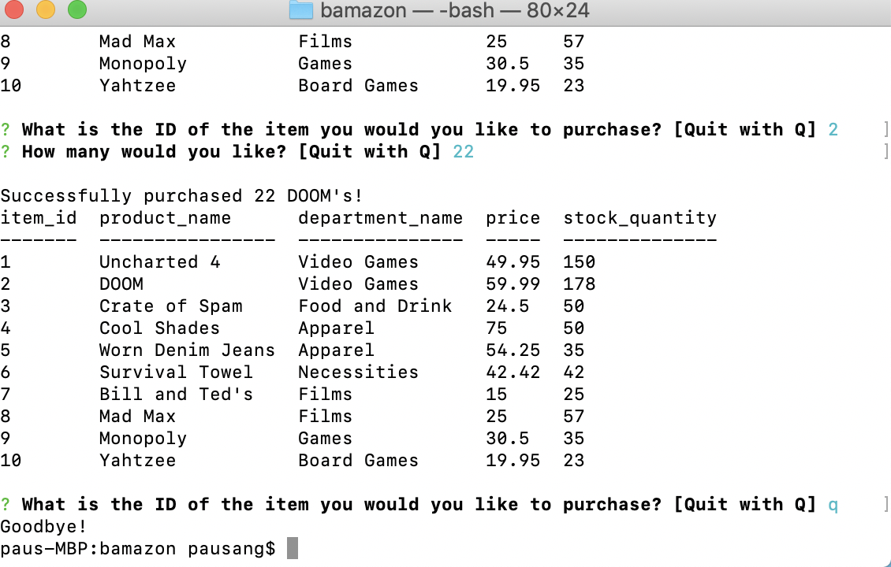

# bamazon #

# Node.js & MySQL

Overview

In this activity, we created an Amazon-like storefront with the MySQL skills from this unit. The app takes in orders from customers and deplete stock from the store's inventory.  This funtionality of this program is dependant on the following npm packages: inquire, mysql, cli-table.

[Node.js(https://dev.to/achowba/build-a-simple-app-using-node-js-and-mysql-19me)MySql]

Quick Start: How to Use MySQL in Node
Maybe you’ve arrived here looking for a quick leg up. If you’re just after a way to get up and running with MySQL in Node in as little time as possible, we’ve got you covered!

Here’s how to use MySQL in Node in 5 easy steps:

Create a new project: mkdir mysql-test && cd mysql-test
Create a package.json file: npm init –y
Install the mysql module: npm install mysql –save
Create an app.js file and copy in the snippet below.
Run the file: node app.js. Observe a “Connected!” message.

[Node.js,MySql(https://www.sitepoint.com/using-node-mysql-javascript-client/)]
